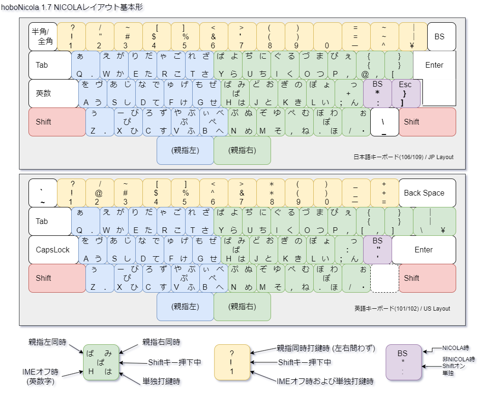

# Hobo-nicola keyboard and adapter library for Arduino environments.

hoboNicola keyboard and adapter library.  Copyright 2023 Takeshi Higasa, okiraku-camera.tokyo

version 1.7.0

## hoboNicolaについて 

hoboNicolaライブラリは、一般的なUSBキーボードをほぼNICOLAキーボードとして使うためのアダプター用ファームウェアとして2018年頃に作りました。このライブラリを使うことで、入力時の配列を(ほぼ)NICOLA配列にすると同時に、NICOLA規格に準じた親指キー同時打鍵入力が可能となります。hoboNicolaライブラリを組み込んだアダプター(USB-USB, PS/2-USB)のことを、hoboNicolaアダプターと称しており、回路などはブログ等で公開されています。

hoboNicolaアダプターはPCなどのホスト側に接続したときふつうのUSBキーボードのように振る舞います。アダプターは物理的なキーボードからの受けたHID Usage ID(キーコード)を使って配列の変更や同時打鍵処理などを行った後、ホストにキーコードを送り出します。

このライブラリは、日本語USBキーボードだけではなくPS/2インタフェースのキーボードや、USレイアウトのキーボード用のアダプターとしても使うことができます。また、キーボードPCBのマイコンに組み込むことで使い手の都合に合わせた親指シフトキーボードのファームウェアとすることも可能です。

## 配列について
hoboNicolaアダプターやキーボードの、NICOLAモードでの文字記号配列は以下のようにしています(バージョン1.7.0以降)。

NICOLA規格での配列規定とは若干ことなっているので、「ほぼ」NICOLAと称してます。

NICOLA規格の詳細については、http://nicola.sunicom.co.jp/spec/jisdraft.htm を参照してください。

## ハードウェアについて
hoboNicolaアダプターは、コントローラとして使うマイコンと、USBやPS/2といったキーボードインタフェース回路を組み合わせたものです。物理的なキーボード側はUSBホストとしてふるまい、PCなどのホストと接続する側はUSBデバイスとしてふるまう必要があります。USBデバイスとしての機能を備えたマイコンを使ったArduinoボードやオリジナルのPCBと、MAX3421EEなどのUSBホストコントローラを組み合わせるのが一般的な構成方法です。

### Arduinoボード
今まで動作を確認しているArduinoボードは以下のとおりです。ビルドのためには各ボード用のBSP (Board Support Package)あるいはコアパッケージの導入が必要です。

* AVR
  * Arduino Leonardo (ATmega32u4 +5V/16MHz)
  * SparkFun Pro Micro (ATmega32u4 +3.3V/8MHz and +5V/16MHz)
* SAMD21
  * Adafruit QTPy SAMD21 (SAMD21E18)
  * Seeed Studio XIAO SAMD21, Seeeduino XIAO (SAMD21G1)
* nRF52840
  * Seeed Studio XIAO nRF52840
  * SwitchScience ISP1807 Micro Board
* RP2040
  * Seeed Studio XIAO RP2040
  * Adafruit KB2040
  * Raspberry Pi Pico

AVRやRP2040については、オリジナルPCBでの動作も確認しています。

## ビルドについて

hoboNicolaLibrary はArduinoのライブラリとして導入することを前提としています。

現在のところ以下の開発ツールでビルドできることを確認しています。
* Windows用のArduino(1.8.19) 
* Visual Studio Code(1.80.0) Arduino-extension 0.6 とarduino-cliが導入済みであること。
* Arduino IDE (2.x.x) でもビルドできると思いますが確認していません。

いくつかのUSBホストコントローラー用の実装やキーボードPCB用の実装は Arduino スケッチ (.inoファイル) として examples ディレクトリに入っているので、ターゲットとするデバイスやマイコンに応じたスケッチを開き、別名で保存するところから、開発を始めることができます。

### 実装例 (examples)

USBホストコントローラーごとに実装例を用意してあり、USBキーボード用の実装は4種類のマイコン(ATMega32U4, ATSAMD21, nRF52840 and RP2040)での動作を確認しています。AVR以外のマイコンを用いる場合、Adafruit TinyUSB ライブラリの導入が必須です。

* ch9350_hobo_nicola	
  * CH9350L をUSBホストコントローラーとして用いるアダプター用の実装です。
* usb_hobo_nicola
  * MAX3421EE (USB Host Shield) をUSBホストコントローラーとして用いるアダプター用の実装です。[felis/USB_Host_Shield_2.0](https://github.com/felis/USB_Host_Shield_2.0) に依存していますが、hoboNicola用の修正を加えた一式をhoboNicolaLibrary内に含んでいるので新たな導入は不要です。
* rp_hobo_nicola
  * 専用のUSB-Hostコントローラを用いずRP2040単独で構成するアダプター用の実装です。この実装では、[sekigon-gonnoc/Pico-PIO-USB](https://github.com/sekigon-gonnoc/Pico-PIO-USB) と [Adafruit_TinyUSB Library](https://github.com/adafruit/Adafruit_TinyUSB_Arduino) が必須です。
* ps2_hobo_nicola
  * PS/2キーボード用アダプターの実装例でATMega32U4のみが対象です。
* xd87
  * XD87 PCB (https://kprepublic.com/) を使った自作キーボード用の実装です。ターゲットのマイコンは ATMega32U4 (+5V/16MHz) なので Arduino Leonardo または SparkFun Pro Micro をターゲットしてビルドします。このキーボードについては [こちらを参照のこと](./assets/xd87.md)。
* xd64
  * XD64(ver3) PCB ver3 (https://kprepublic.com/) を使った自作キーボード用の実装です。ターゲットのマイコンはXD87と同じです。このキーボードについては [こちらを参照のこと](./assets/xd64.md)。

なお、hoboNicolaライブラリを自作キーボードに適用する際には、キーボードPCBの回路構成を知っておく必要があります。

### ギャラリー

アダプターやキーボードの[フォトギャラリーはこちら](./assets/hobonicola_gallery.md) 。

## What's hobo-nicola 

The hobo-Nicola library is firmware for hardware adapters that allow general Japanese USB keyboard to be used as "almost NICOLA keyboard". By using this library, you can get (almost) NICOLA layout kayboard. And at the same time, you can use simultaneous typing method with Thumb-shift keys according to the NICOLA standard. Adapters (USB-USB, PS/2-USB) that incorporate the hobo-Nicola library are called hobo-Nicola adapters, and their circuits are publicly published.

The hoboNicola adapter behaves as a USB HID keyboard when connected to a host such as PC. The adapter uses the HID Usage ID (keycode) received from the physical keyboard to change the layout and perform simultaneous keystroke processing, etc., and then sends the keycode to the host.

This library can be used not only for Japanese USB keyboards, but also as adapters for PS/2 interface keyboards and US layout keyboards. In addition, it is also possible to make the firmware of the keyboard itself. You can build the almost NICOLA keyboard by incorporating this library into the micro controller of the keyboard PCB.

## What's NICOLA keyboard

The NICOLA keyboard is one of the keyboard standards for typing Japanese using PCs and WSs, established at the end of the 20th century. This standard inherits the input method of a dedicated word processor called ”OASYS", which had been manufactured by Fujitsu.

It features a unique key layout for typing the many Japanese kana and symbols with fewer keys. And it has a simultaneous typing method with the two Thumb-shift keys to select kanas, numbers and symbols from multiplexed keys.

For details, please refer to the following site (written in Japanese). http://nicola.sunicom.co.jp/spec/jisdraft.htm

### Photo gallery

Photo gallery of adapters and keyboards is [here](./assets/hobonicola_gallery.md) 

